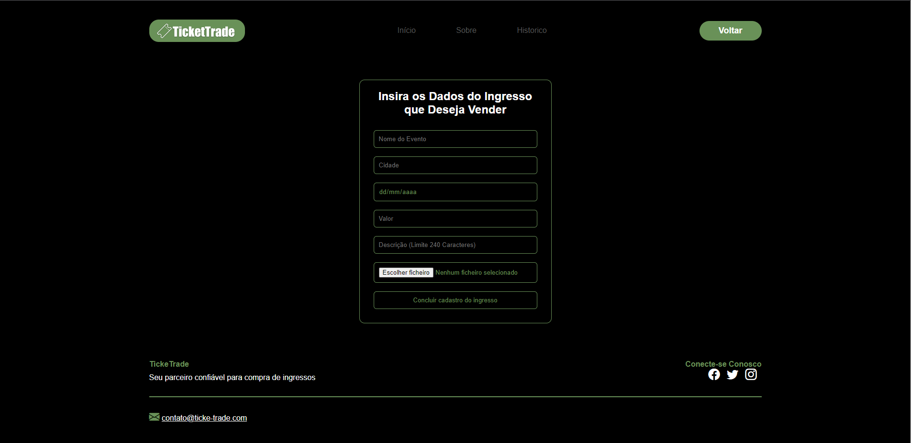

## 6. Interface do sistema

Visão geral da interação do usuário pelas telas do sistema. Apresente as principais interfaces da plataforma. 

## 6.1. Tela principal do sistema

A página inicial da acesso a maioria das utilidades e funçoes do software, sendo um caminho para uma ótima experiencia do usuário.

## 6.1. Telas do processo 1

A tela de login é o acesso ao software para aquele usuário ja cadastrado previamente, utilizando como parametros o usuário e senha definidas pelo mesmo.

A tela de cadastro é a tela essencial do site, sem ela o usuário nao conseguirá usufruir das funcionalidades providas pelo software. O cadastro utiliza de diversos parametros para garantir integridade e segurança para os usuários.

## 6.1. Telas do processo 2

A tela de gerenciamento de postagem ou venda do ingresso tem a funçao de facilitar, através dos filtros preenchidos pelo usuário que deseja vender, a busca do comprador, utilizando diversos parametros como a cidade, data e nome do evento.

A tela de busca de ingresso serve para o usuário filtrar e encontrar o evento que deseja realizar a compra do ingresso. Junto dela, é possível notar a presença de uma tabela que conta com os resultados da busca filtrada realizada pelo usuário.

A tela do ingresso escolhido pelo usuário que deseja comprar conta com uma descriçao mais completa do produto, e com caminhos para que seja realizado o processo de pagamento.

## 6.1. Telas do processo 3

A tela de seleçao de pagamento é de extrema importancia para o usuário, visto que esse poderá escolher entre as duas formas propostas pelo site, tanto o PIX, quanto o boleto. A tela conta com duas imagens didáticas que redirecionam para as respectivas formas de execuçao do pagamento.

A tela de pagamento por pix possui o QrCode escaneável para a realizaçao do pagamento, ou se o cliente preferir, ha a possibilidade de cópia do código para transferencia.

A tela de pagamento por boleto é semelhante a anterior, visto que irá apresentar o boleto gerado contendo os dados da transaçao do usuário. Um exemplo, é o código de barras utilizado para o pagamento.

## 6.1. Telas do processo 4

O processo 4, como explicado nos encontros para desenvolvimento do trabalho, nao conta com telas esteticamente visíveis para o usuário, visto que se baseia em açoes administrativas de pagamento.

## 6.1. Telas do processo 5

Ao acessar o histórico, encontra-se o botao de Rating, que ao ser acessado o usuário poderá avaliar através de estrelas a sua experiencia com o usuário com o qual realizou a transaçao. Além disso, é possivel o preenchimento em texto relatando a sua experiencia, e em caso de uma negativa, é possível ser encaminhado para a aba de denúncias através do botao de Denunciar.

A tela de denuncia tem funçao de preservar um ambiente seguro e confiável aos usuarios. Ao acessar a tela principal, os usuários tem a possibilidade de entrar na tela através de um botao de denuncia, que irá encaminhá-lo para a tela principal de denuncia. A tela principal conta com um campo de texto para que o usuário possa escrever a experiencia ruim que ocorreu, sendo recebida pelos administradores.

A tela de atribuir puniçao ou comunicar ao usuário é de acesso exclusivo dos administradores, sendo utilizada para realizar comandos de acesso exclusivos.

## 6.1. Telas do processo 6

O processo 4, como explicado nos encontros para desenvolvimento do trabalho, nao conta com telas esteticamente visíveis para o usuário, visto que se baseia em açoes administrativas de pagamento.

