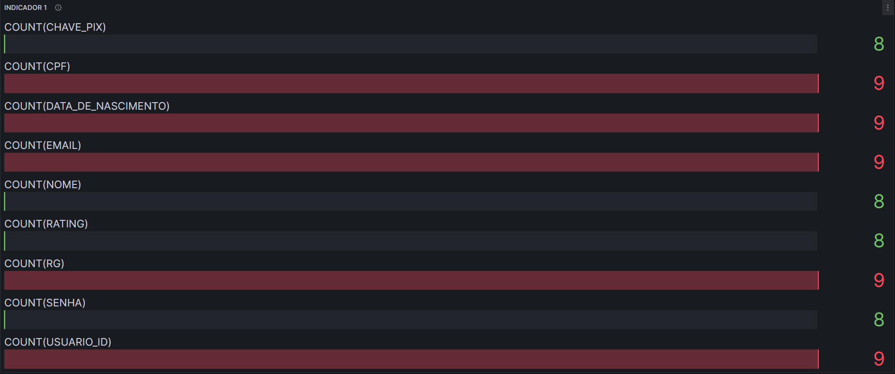

## 5. Indicadores de desempenho

| **Indicador** | **Objetivos** | **Descrição** | **Fonte dados** | **Perspectiva** |
| ---           | ---           | ---           | ---             | ---             |
| Número total de clientes | Calcular o aumento do número de clientes cadastrados para avaliar o crescimento do site | Calcular o aumento ou diminuição do número de clientes cadastrados mensalmente (30 dias)| Tabela de Usuários  | Aprendizado e Crescimento |
| Aumento do número de ingressos vendidos | Calcular o número de unidades de ingressos vendidos para avaliar o crescimento do site | Calcular o aumento ou diminuição  do número de unidades de ingresso vendidos mensalmente (30 dias) | Tabela de Venda  |  Financeira |
| Taxa de erro no processo de Pagamento | Calcular o número de erros no processo de pagamento | Calcular o número de pagamentos que resultaram em erro em relação ao numero de pagamentos totais efetuados mensalmente (30 dias) | Tabela Compra  | Aprendizado e Crescimento|
| Taxa de variação de lucro líquido | Verificar o lucro líquido obtido  para avaliar o crescimento do site | Calcular o lucro líquido mensalmente (30 dias) | Tabela Compra  | Financeira |
| Taxa de variação do número de denúncias | Verificar o número de denúncias para avaliar a comunidade de clientes e vendedores do site| Calcular o número de denúncias mensalmente (30 dias)| Tabela Denúncia | Processos Internos |
| Número de vendas concluidas com sucesso | Calcular o número de vendas concluidas com sucesso para verificar o funcinamento do site | o número de vendas concluidas com sucesso mensalmente (30 dias) | Tabela Venda  | Processos Internos |

## GRAFICO INDICADOR 1

