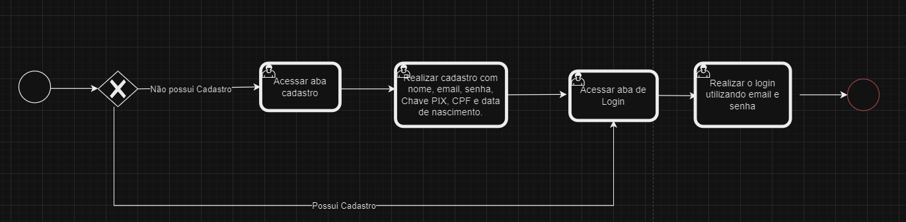

### 3.3.1 Processo 1 – Elaboraçao do cadastro e login.

Elaboração do cadastro e login - facilita o controle de usuários e contribui para o sistema de rating e denúncias funcionarem efetivamente.

#### Detalhamento das atividades

**Login**

| **Campo**       | **Tipo**         | **Restrições** | **Valor default** |
| ---             | ---              | ---            | ---               |
| login           | Caixa de Texto   | formato de e-mail |                |
| senha           | Caixa de Texto   | mínimo de 8 caracteres |           |

| **Comandos**         |  **Destino**                   | **Tipo** |
| ---                  | ---                            | ---               |
| Sign In           | Início do proceso de Login  |                   |
| Log In           |  Página inicial do site |                   |

**Cadastro**

| **Campo**       | **Tipo**         | **Restrições** | **Valor default** |
| ---             | ---              | ---            | ---               |
| Nome       | Caixa de Texto   | somente caracteres alfabéticos |                |
| email         | Caixa de Texto   | formato de e-mail |                |
| senha           | Caixa de Texto   | mínimo de 8 caracteres |           |
| CPF             | Caixa de Texto   | 11 caracteres          |           |
| Data de nascimento | Data        | Data Válida         |           |
| Chave PIX          | Caixa de Texto   |       |           |

| **Comandos**         |  **Destino**                   | **Tipo**          |
| ---                  | ---                            | ---               |
| Cadastrar            | Início do proceso de cadastro  |                   |
| Concluir Cadastro    |  Fim do processo de cadastro  |                   |
