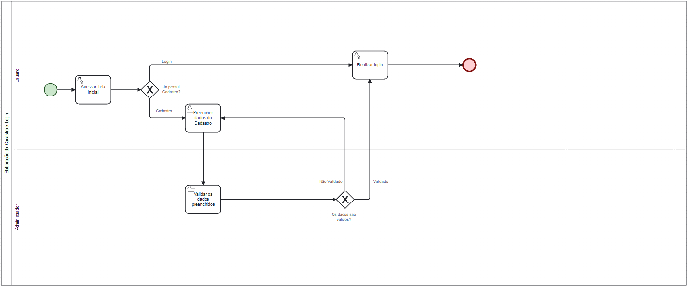

### 3.3.1 Processo 1 – Elaboraçao do cadastro e login.

facilita o controle de usuários e contribui para o sistema de rating e denúncias funcionarem efetivamente.

#### Detalhamento das atividades

Descreva aqui cada uma das propriedades das atividades do processo 1. 
Devem estar relacionadas com o modelo de processo apresentado anteriormente.

Os tipos de dados a serem utilizados são:

* **Área de texto** - campo texto de múltiplas linhas
* **Caixa de texto** - campo texto de uma linha
* **Número** - campo numérico
* **Data** - campo do tipo data (dd-mm-aaaa)
* **Hora** - campo do tipo hora (hh:mm:ss)
* **Data e Hora** - campo do tipo data e hora (dd-mm-aaaa, hh:mm:ss)
* **Imagem** - campo contendo uma imagem
* **Seleção única** - campo com várias opções de valores que são mutuamente exclusivos (tradicional radio button ou combobox)
* **Seleção múltipla** - campo com várias opções que podem ser selecionadas mutuamente (tradicional checkbox ou listbox)
* **Arquivo** - campo de upload de documento
* **Link** - campo que armazena uma URL
* **Tabela** - campo formado por uma matriz de valores

**Login**

| **Campo**       | **Tipo**         | **Restrições** | **Valor default** |
| ---             | ---              | ---            | ---               |
| login           | Caixa de Texto   | formato de e-mail |                |
| senha           | Caixa de Texto   | mínimo de 8 caracteres |           |
| CPF             | Caixa de Texto   | 11 caracteres          |           |
| Data de nascimento | Data        | Data Válida         |           |

| **Comandos**         |  **Destino**                   | **Tipo** |
| ---                  | ---                            | ---               |
| [Nome do botão/link] | Atividade/processo de destino  | (default/cancel/  ) |
| ***Exemplo:***       |                                |                   |
| entrar               | Fim do Processo 1              | default           |
| cadastrar            | Início do proceso de cadastro  |                   |

**Cadastro**

| **Campo**       | **Tipo**         | **Restrições** | **Valor default** |
| ---             | ---              | ---            | ---               |
| Nome       | Caixa de Texto   | somente caracteres alfabéticos |                |
| email         | Caixa de Texto   | formato de e-mail |                |
| senha           | Caixa de Texto   | mínimo de 8 caracteres |           |
| CPF             | Caixa de Texto   | 11 caracteres          |           |
| Data de nascimento | Data        | Data Válida         |           |
| Chave PIX          | Caixa de Texto   |       |           |

| **Comandos**         |  **Destino**                   | **Tipo**          |
| ---                  | ---                            | ---               |
| [Nome do botão/link] | Atividade/processo de destino  | (default/cancel/  ) |
|                      |                                |                   |
