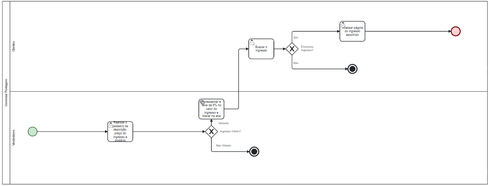

### 3.3.2 Processo 2 – Gerenciar Postagem.

Gerenciar Ponstagem - Contribui para o usuário, que deseja efetuar a compra ou venda de algum ingresso, conseguir encontrá-lo e vendê-lo mais rapidamente.

**Postagem**

| **Campo**       | **Tipo**         | **Restrições** | **Valor default** |
| ---             | ---              | ---            | ---               |
| Descrição       |  Caixa de Texto  |---             | (informe a descição)|
| Preço           |  Número          | ---            |    default        |

| **Comandos**         |  **Destino**                                  | **Tipo**   |
| ---                  | ---                            | ---               |
| Finalizar cadastro   | Finalizar o processo de cadastro de ingresso  |  (Botão)   |
| cadastrar            | Iníciar o processo de cadastro de ingresso    |  (Botão)   |

**Busca de ingresso**

| **Campo**       | **Tipo**                                  | **Restrições**         | **Valor default**          |
| ---             | ---                                        | ---                    | ---               |
| Busca ingresso  |  Caixa de Texto                           |                        | (insira o nome do ingresso)|
| Tabela          |  Campo com todos os ingressos disponivéis |                        | Default                    |

| **Comandos**         |  **Destino**                               | **Tipo**        |
| ---                  | ---                            | ---               |
| Buscar               | Realiza a busca do ingresso                | (Botão)         |
| Realizar pagamento   | Inicia o processo de pagamento do ingresso |  (Botão)        |
