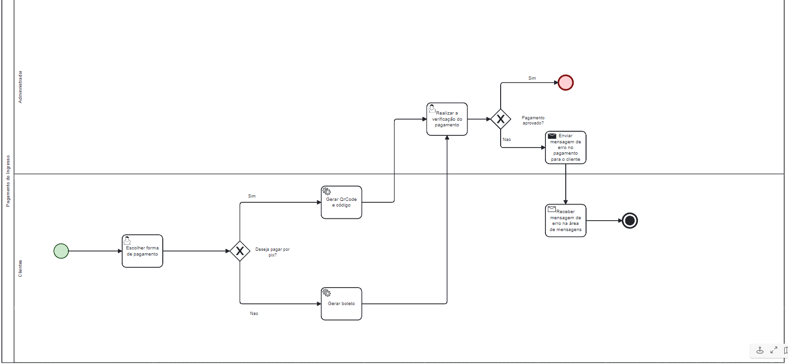

### 3.3.3 Processo 3 – Pagamento-do-ingresso

Pagamento do Ingresso - Este processo agiliza a compra e venda de ingressos, permitindo um ambiente confiável para o comprador através de uma intermediação feita pelo sistema.

**Pamento Pix**

| **Campo**       | **Tipo**         | **Restrições** | **Valor default** |
| ---             | ---              | ---            | ---               |
| Forma de Pagamento         | Seleção única   | Seleçao |                |
| QrCode        | Imagem   | QrCode |           |
| Codigo PIX         | Caixa de Texto   | Numeros, Caracteres especiais e Texto |           |
| Código de barras     | Imagem   | Código de barras |           |

| **Comandos**         |  **Destino**                   | **Tipo** |
| ---                  | ---                            | ---               |
| [Nome do botão/link] | Atividade/processo de destino  | (default/cancel/  ) |
| ***Exemplo:***       |                                |                   |
| Escolher forma de pagamento              | Iniciar pagamento            | default           |
| Concluir pagamento        | Fim do processo de pagamento |                   |

**Pagamento Boleto**

| **Campo**       | **Tipo**         | **Restrições** | **Valor default** |
| ---             | ---              | ---            | ---               |
| Código de barras     | Imagem   | Código de barras |           |
| Codigo do boleto         | Caixa de Texto   | Numeros, Caracteres especiais e Texto |           |

| **Comandos**         |  **Destino**                   | **Tipo**          |
| ---                  | ---                            | ---               |
| Escolher forma de pagamento              | Iniciar pagamento            | default           |
| Concluir pagamento        | Fim do processo de pagamento |                   |
