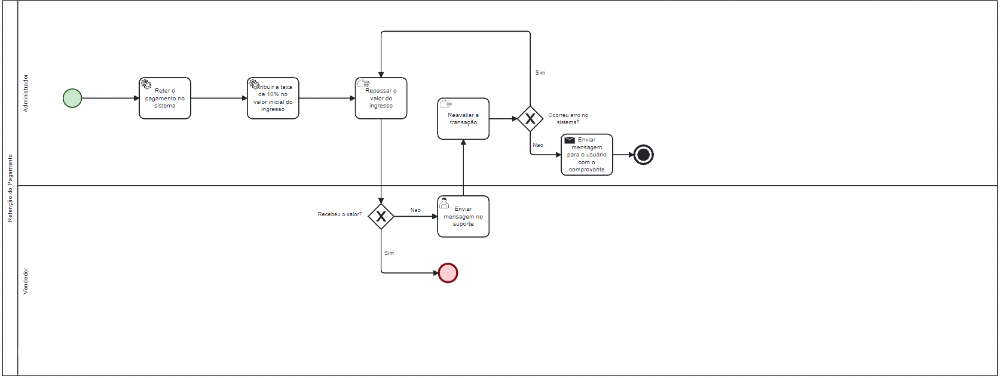

### 3.3.4 Processo 4 – Retençao do pagamento.

Retenção do Pagamento - Este processo é utilizado para garantir maior segurança no aplicativo, retendo o pagamento e não repassando para o vendedor até que a troca de titularidade seja efetuada.  Prevenindo assim, casos de golpe ou outras falhas de segurança.

**Enviar mensagem de suporte**

| **Campo**       | **Tipo**         | **Restrições** | **Valor default** |
| ---             | ---              | ---            | ---               |
| Mensagem Suporte| Caixa de Texto   | 240 caractéres |(Null)             |

| **Comandos**         |  **Destino**                   | **Tipo**        |
| ---                  | ---                            | ---             |
| Enviar               |Retorna a paginma inicial       | (Defalt)        |

**Enviar mensagem para o uusuário com o comprovante**

| **Campo**       | **Tipo**         | **Restrições** | **Valor default** |
| ---             | ---              | ---            | ---               |
| Inserir Comprovante | Imagem       | Imagem         | (Null)            |
| Mensagem Para o Usuário| Caixa de Texto |  240 caractéres| (Null)       |

| **Comandos**         |  **Destino**                   | **Tipo**   |
| ---                  | ---                            | ---        |
| Adicionar Arquivo    | Galeria/Pasta, de Arquivos     | (default)  | 
| Enviar               | Retorna Pagina inicial         | (default)  |

