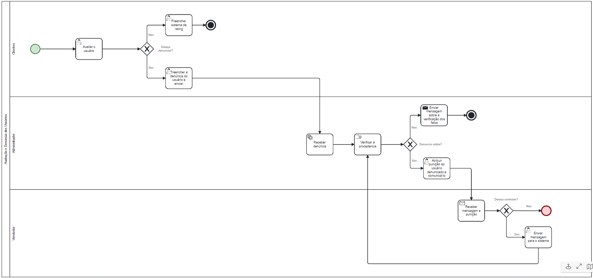

### 3.3.5 Processo 5 – Avaliaçao e denúncia dos usuários.

Avaliação e denúncia dos usuários - Este processo é usado para melhorar a segurança e confiabilidade do Ticket Trade com um sistema de denúncias para reportar e punir usuários mal intencionados do aplicativo.

**Avaliar o usuário**
| **Comandos**         |  **Destino**                   | **Tipo** |
| ---                  | ---                            | ---               |
| Rating            | Inicio do preenchimento do rating        | default           |
| Denuncia         | Inicio do preenchimento da denuncia       | default           |
**Preencher sistema de rating**

| **Campo**       | **Tipo**         | **Restrições** | **Valor default** |
| ---             | ---              | ---            | ---               |
| Avaliaçao         | Seleçao única   | 1 a 5 estrelas | (null)         |

| **Comandos**         |  **Destino**                   | **Tipo**          |
| ---                  | ---                            | ---               |
| Enviar     | Retorna ao historico de ingressos|          (default)         |

**Preencher denúncias do usuário e enviar**

| **Campo**       | **Tipo**         | **Restrições** | **Valor default** |
| ---             | ---              | ---            | ---               |
| Denuncia          | Caixa de Texto   | maximo de 240 caracteres | (null)|
| Ingresso      | Imagem  | .jpg | imagem do ingresso|

| **Comandos**         |  **Destino**                   | **Tipo**          |
| ---                  | ---                            | ---               |
| Enviar     | Retorna ao historico de ingressos do cliente|   (default)                |
| Concluir       | Pagina Inicial  |        (default)           |

**Atribuir puniçao ao usuario denunciado e comunicá-lo**

| **Campo**       | **Tipo**         | **Restrições** | **Valor default** |
| ---             | ---              | ---            | ---               |
| Mensagem          | Caixa de Texto   | maximo de 240 caracteres | (null)|

| **Comandos**         |  **Destino**                   | **Tipo**          |
| ---                  | ---                            | ---               |
| Enviar     | Retorna para a tela inicial de administrador|   (default)                |
| Banir   | Retorna para a pagina de denuncias gerais do administrador|   (default)                |
| Punir    |  Retorna para a pagina de denuncias gerais do administrador|   (default)                |

**Enviar mensagem para o sistema**

| **Campo**       | **Tipo**         | **Restrições** | **Valor default** |
| ---             | ---              | ---            | ---               |
| Mensagem          | Caixa de Texto   | maximo de 240 caracteres | (null)|

| **Comandos**         |  **Destino**                   | **Tipo**          |
| ---                  | ---                            | ---               |
| Enviar     | Pagina Inicial |   (default)                |

