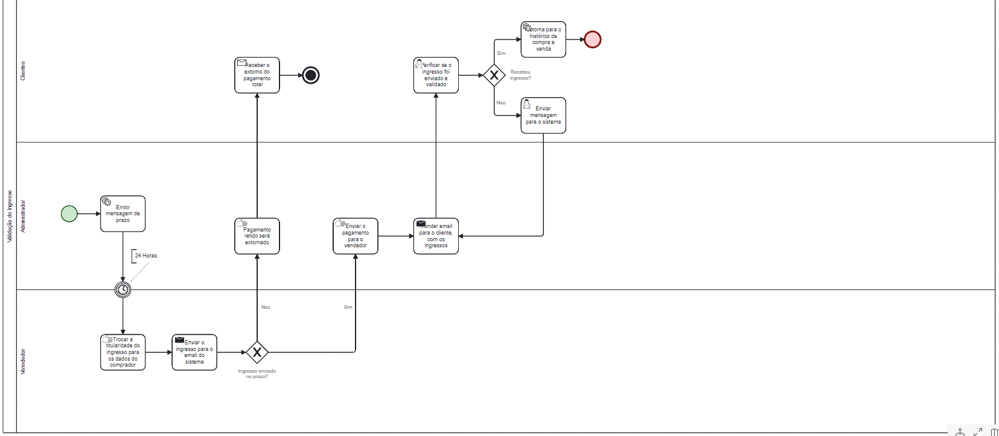

### 3.3.1 Processo 6 – Validaçao do ingresso.

Validação do ingresso - Este processo melhora o sistema de proteção do software, fazendo com que o pagamento só seja repassado após a garantia de integridade do ingresso, através da troca do titular. Portanto, não permite que o vendedor ou comprador aproveitem de maneira problemática do sistema.

**Trocar Titularidade**

| **Campo**       | **Tipo**         | **Restrições** | **Valor default** |
| ---             | ---              | ---            | ---               |
| Nome            | Caixa de Texto   | 80 caracteres  |                   |
| CPF             | Caixa de Texto   | 11 caracteres  |                   |
| Data de nascimento | Data          | Data Válida    |                   |

| **Comandos**         |  **Destino**                   | **Tipo**     |
| ---             | ---              | ---            | 
| Iniciar              | inicio da troca de titularidade| (Botão)       |
| Finalizar            | Fim da troca de titularidade   | (Botão)       |

**Verificar Validação do Ingresso**

| **Campo**       | **Tipo**         | **Restrições** | **Valor default** |
| ---             | ---              | ---            | ---               |
| Ingresso        | Caixa de Texto   | Textos e Imagens|                  |

| **Comandos**         |  **Destino**                   | **Tipo**          |
| ---                  | ---                            | ---               |
| Ingresso Validado   | Ingresos do Cliente            |(Botão)              |
| Ingresso Não Validado | Envio de mensagem para o Sistema| (Botão)           |
