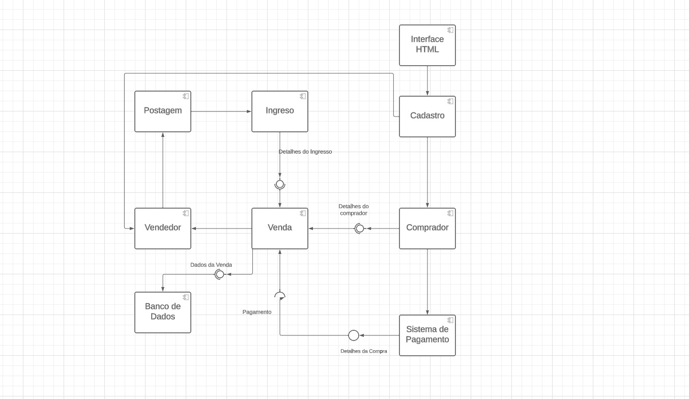
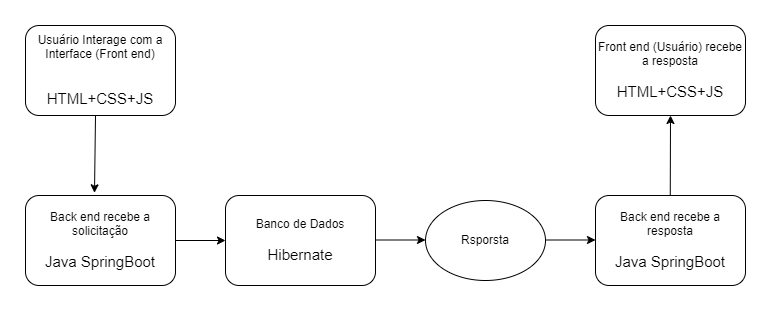
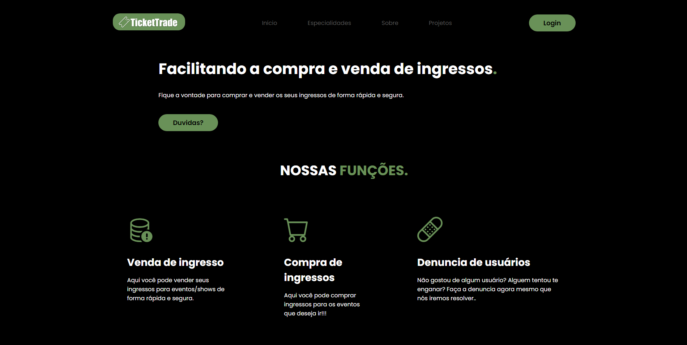
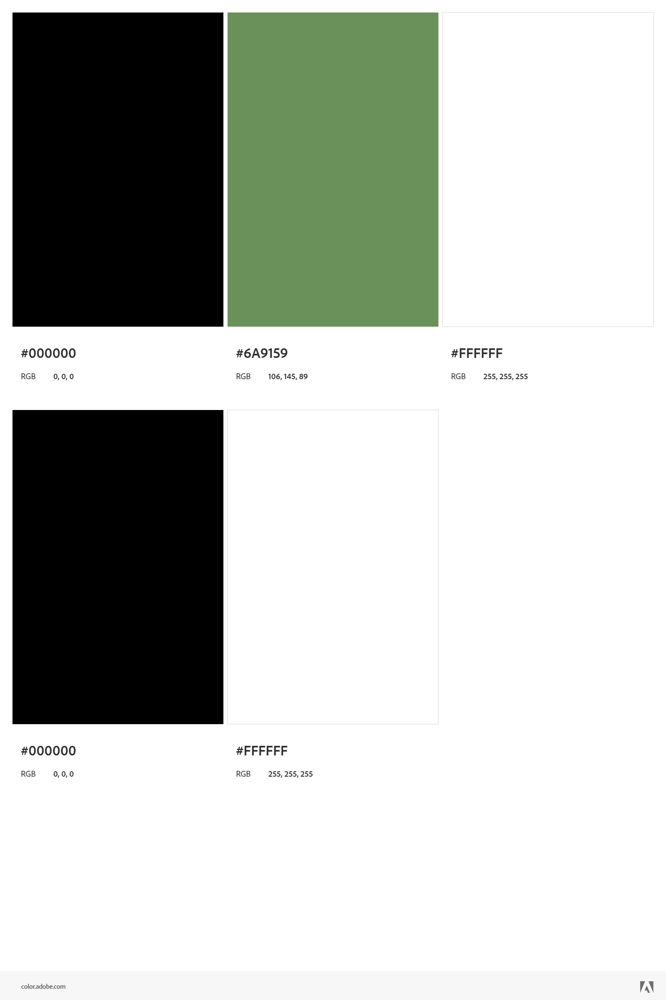

## 4. Projeto da solução

### 4.1. Diagrama de classes

_O diagrama a seguir apresenta a composição de classes peliminar do nosso projeto. Conta com as classes Usuário que contem os dados principais dos usuários; as classes de rating e denúncia que tem as respectivas funções de avaliar e deununciar um usuário; a classe notificações que é responsavel por emitir as notificações necessárias; a classe ingresso que possui os dados fundementais do ingresso; a classe pagamento que possui os metodos necessários para possibilitar o pagamento; a classe TrocaTitularidade responsável por possiblilitar a troca de titularidade do ingresso e, enfim, a classe administrador que atua na administração, análise e verificação de disveros dados utilizados no software._

### 4.2. Diagrama de componentes

Conforme diagrama apresentado, as entidades participantes da solução são:

- **Sistema de Pagamento** - Sistema onde ocorre a logica de pagamanto e a verificacao , no caso , pix ou boleta.
- **Banco de Dados** - Onde os dados de compras e vendas serao guardados e as informacoes de clientes e vendedores.
- **Vendedor** - Usuario que aloca o seu ingresso para ser vendido.
- **Comprador** - Usuario que participa de compras de ingressos no aplicativo. 
- **Venda** - Ação de venda do ingresso desejado.
- **Postagem** - Ação de postagem do ingresso na rede.
- **Interface html** - A interface do aplicativo que comunica com o usuário.
- **Cadastro** - Processo de recolhimento de dados e cadastro dos usuários.
- **Ingresso** - Produto comercioado no aplicativo.

    

### 4.3. Modelo de dados

### 4.4. Tecnologias

| **Dimensão**   | **Tecnologia**  |
| ---            | ---             |
| Persistência   | Hibernate       |
| Front end      | HTML+CSS+JS     |
| Back end       | Java SpringBoot |
| Log do sistema | Log4J           |
| Teste          | JUnit           |
| Deploy         | Github Pages    |
|      Comunicação            | Discord            |
|      Desenvolvimento     |  VSCode + Camunda + Draw.io            |

### 4.5. Guias de estilo

## Design

Logo: estará apresentada na parte superior esquerda da tela, conforme a imagem.

Login: Canto superior Direito

Venda de ingressos: Acessa aba para vender ingresso.

Compra de ingressos: Acessa aba para comprar ingresso.

Denuncia: Acessa aba de denuncia de usuário.

## Cores

## Tipografia

O tipo de fonte apresentado no projeto sera: 'Poppins', sans-serif;

## Iconografia

.icon-logo {color: #6A9159; /*Verde musgo/* border_radius: 30px;/*Levemente arredondado/* padding: 10px; } 

.icon-buy { color: #6A9159; /*Verde musgo/*  padding: 10px; } 

.icon-vender { color: #6A9159; /*Verde musgo/*  padding: 10px; } 

.icon-denuncia  { color: #6A9159; /*Verde musgo/*  padding: 10px; }

.login: color { #6A9159; /*Verde musgo/* border_radius: 30px;/*Levemente arredondado/* padding: 10px; }

// Padrao de icone cor: #6A9159, padding: 10px, arredondamento: 30px,

> **Links Úteis**:
>
> - [Como criar um guia de estilo de design da Web](https://edrodrigues.com.br/blog/como-criar-um-guia-de-estilo-de-design-da-web/#)
> - [CSS Website Layout (W3Schools)](https://www.w3schools.com/css/css_website_layout.asp)
> - [Website Page Layouts](http://www.cellbiol.com/bioinformatics_web_development/chapter-3-your-first-web-page-learning-html-and-css/website-page-layouts/)
> - [Perfect Liquid Layout](https://matthewjamestaylor.com/perfect-liquid-layouts)
> - [How and Why Icons Improve Your Web Design](https://usabilla.com/blog/how-and-why-icons-improve-you-web-design/)
